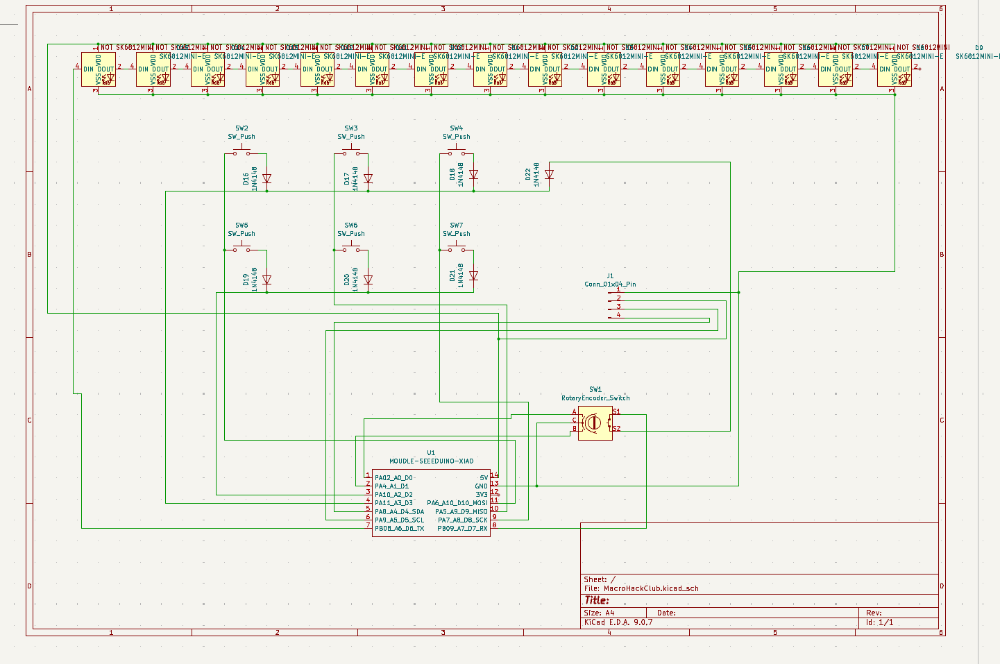
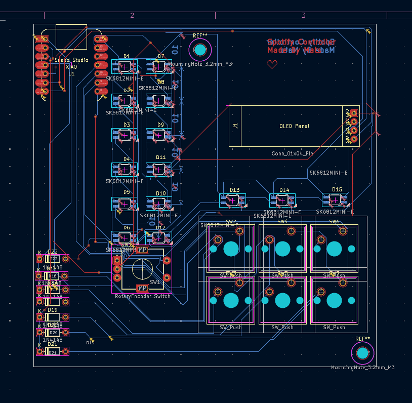

# Spotify Controller Hackpad

A custom macropad for Spotify control, built with a Seeed XIAO (RP2040), rotary encoder, RGB lighting, and OLED support.

## Screenshot: Overall Hackpad

## Screenshot: Schematic

## Screenshot: PCB

## Screenshot: Case + Fit Together

## BOM (Bill of Materials)

|  Id | Designator                                                       | Footprint                                      | Quantity | Designation           |
| --: | ---------------------------------------------------------------- | ---------------------------------------------- | -------: | --------------------- |
|   1 | D18, D16, D17, D22, D19, D20, D21                                | D_DO-35_SOD27_P7.62mm_Horizontal               |        7 | 1N4148                |
|   2 | D1, D7, D2, D8, D3, D9, D4, D10, D6, D5, D12, D11, D15, D14, D13 | SK6812MINI-E_fixed                             |       15 | SK6812MINI-E          |
|   3 | U1                                                               | XIAO-Generic-Hybrid-14P-2.54-21X17.8MM         |        1 | MOUDLE-SEEEDUINO-XIAO |
|   4 | SW1                                                              | RotaryEncoder_Alps_EC11E-Switch_Vertical_H20mm |        1 | RotaryEncoder_Switch  |
|   5 | SW3, SW5, SW7, SW4, SW6, SW2                                     | SW_Cherry_MX_1.00u_Plate                       |        6 | SW_Push               |
|   6 | J1                                                               | SSD1306-0.91-OLED-4pin-128x32                  |        1 | Conn_01x04_Pin        |

## Firmware Notes

- QMK-based firmware files live in [Firmware/](Firmware/).
- Main keymap: [Firmware/keymap.c](Firmware/keymap.c)
- Hardware config: [Firmware/config.h](Firmware/config.h)
- Keyboard metadata: [Firmware/info.json](Firmware/info.json)
